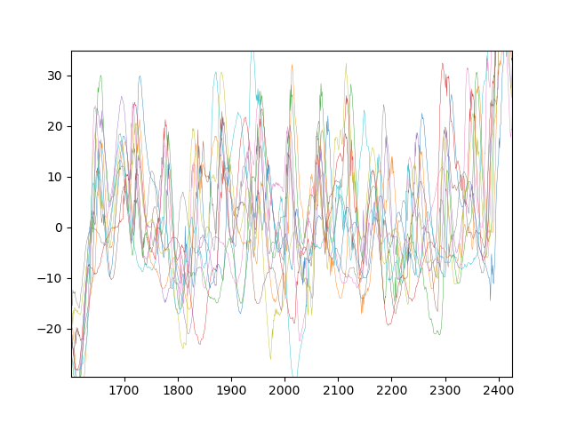

## Tracing the Traces (Crypto, 1 point)

    These traces (.trs and .mat format) were captured from a hardware device performing a certain cryptographic calculation. The trace files contain input/output data as well as the corresponding power measurements for (part of) the cryptographic operation. Can you get the key?


We are provided the traces in both [Riscure Inspector Format](traces.trs) and [Matlab](traces.mat) format along with an overview of a trace.


With the inputs, outputs, and power measurements of the operation we can perform a Correlation Power Analysis (CPA) attack. Reading through previous writeups and searching for tools to do just this we come across [Jlsca](https://github.com/Riscure/Jlsca) which conveniently supports the trs format. We also find [tutorials written using RHMe2 challenges for Jlsca](https://github.com/ikizhvatov/jlsca-tutorials).

Fantastic! We appear to have everything we need already. Let's get cracking.

---

The first step is getting [Julia](https://julialang.org/) setup in our environment. It's always interesting to see a new language and it's design decisions.


Once we have that we can run the example scripts against our data. Spoiler alert: they didn't work. Let's take a look at the tutorials we found. _I used the first tutorial [piece of SCAke](https://github.com/ikizhvatov/jlsca-tutorials/blob/master/rhme2-pieceofscake.ipynb) but had to switch to the second tutorial [still not SCAry](https://github.com/ikizhvatov/jlsca-tutorials/blob/master/rhme2-stillnotscary.ipynb) for reasons that will become apparent shortly to you dear reader._

Our data is already in trs format so we can skip the first section of the tutorial. Copying the finished code we don't get the code sadly. So let's keep following the tutorial and inspect the traces. Our first step is to load in the traces and plot them so we can view our data. Viewing the traces and zooming in on a section quickly reveals they are misaligned.

```julia
using Jlsca.Sca
using Jlsca.Trs
using Jlsca.Align
using Jlsca.Aes
using PyCall
using PyPlot.plot,PyPlot.figure

@pyimport numpy

filename = ARGS[1]
trs = InspectorTrace(filename)

((data,samples),eof) = readTraces(trs, 1:10);
plot(samples[1:10,:]',linewidth=.3);
```



Continuing with the second tutorial we can begin to align the traces. I first tried a referencestart and referenceend containing the entire sequence from 1 to 6095. With that not working i tried the end, the start, and finally a point in the middle worked. _Since then i've read further into the writeups from RHMe2 and using an SBOX section is a good point as they were never shifted. (i think)_


```julia
maxShift = 1000
referencestart = 3000
referenceend = 5000
reference = trs[3][2][referencestart:referenceend]
corvalMin = 0.4
alignstate = CorrelationAlignFFT(reference, referencestart, maxShift)
addSamplePass(trs, x -> ((shift,corval) = correlationAlign(x, alignstate); corval > corvalMin ? circshift(x, shift) : Vector{eltype(x)}(0)))
```

Now let's perform the actual CPA attack. We can add a check that verifies an input and output to ensure our recovered key is correct in case it's not an obvious looking key.

```julia
params = AesSboxAttack()
params.analysis = IncrementalCPA()
params.analysis.leakages = [HW()]
numberOfTraces = length(trs);

setPostProcessor(trs, IncrementalCorrelation())
key = sca(trs, params, 1, numberOfTraces)

w = KeyExpansion(key, 10, 4)
if (Cipher(trs[1][1][1:16], w) == trs[1][1][17:32])
  println("Success!")
end
```

```
$ julia -i solve.jl traces.trs
[x] Skipping unknown tag 70 with length 5
[x] Skipping unknown tag 73 with length 1
[x] Skipping unknown tag 74 with length 1
[x] Skipping unknown tag 75 with length 4
[x] Skipping unknown tag 76 with length 4
[x] Skipping unknown tag 104 with length 4
[x] Skipping unknown tag 105 with length 1
[x] Skipping unknown tag 106 with length 1
Opened traces.trs, #traces 300, #samples 6095 (Float32), #data 32

Jlsca running in Julia version: 0.6.0, 1 processes/1 workers/1 threads per worker

AES Sbox IncrementalCPA attack parameters
leakages:   Jlsca.Sca.Leakage[Jlsca.Sca.HW()]
mode:       CIPHER
key length: KL128
direction:  FORWARD
target:     Sbox out
data at:    1
key bytes:  [1, 2, 3, 4, 5, 6, 7, 8, 9, 10, 11, 12, 13, 14, 15, 16]

phase: PHASE1

Running processor Jlsca.Sca.IncrementalCorrelation on all traces, using trace set with 1 data passes, 1 sample passes
Processing traces 1:300.. 100%|█████████████████████████| Time: 0:00:08
Results @ 300 traces
[...]
recovered key material: cafebabedeadbeef0001020304050607
recovered key: cafebabedeadbeef0001020304050607
Success!
```

Working solution: [solve.jl](solve.jl)

**cafedeadbeef01020304050607**
